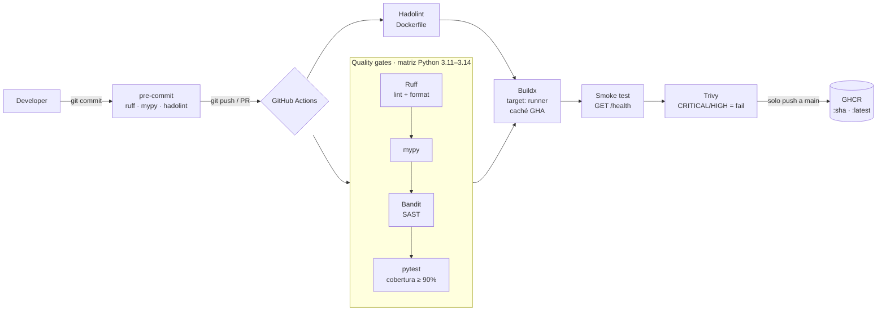
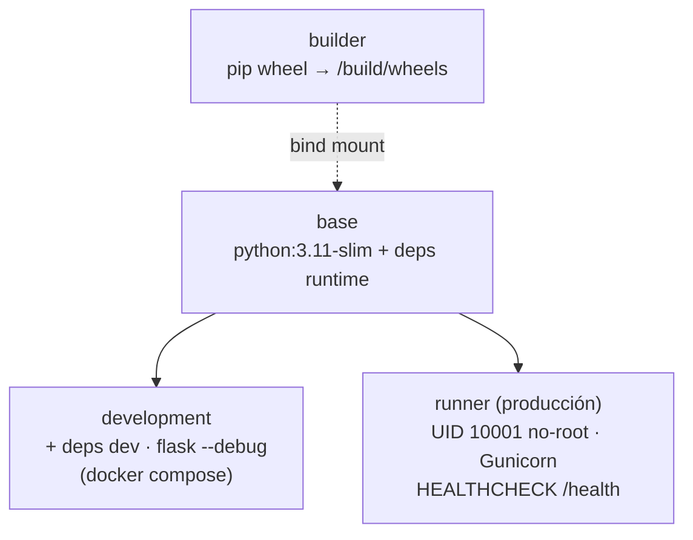

[English](README.md) | **Español**

# CI/CD Pipeline — API Flask lista para producción

Una API REST en Flask que pasa por un pipeline CI/CD con controles de seguridad: lint, tipado, SAST, pruebas, imagen Docker endurecida, prueba de humo, escaneo de vulnerabilidades y publicación en GHCR.

[](https://github.com/DiegoTepichin/cicd-pipeline/actions/workflows/ci-cd.yml?query=branch%3Amain)


[](LICENSE)

La API es deliberadamente pequeña. Su propósito es servir de **vehículo para una cadena de entrega de software completa**. Cada cambio pasa por lint, tipado estático, análisis de seguridad, pruebas con umbral de cobertura, construcción de una imagen endurecida, una prueba de humo y un escaneo de vulnerabilidades. Solo después de todo eso se publica la imagen en un registro de contenedores.

<!-- TODO: screenshot — resumen de una ejecución verde de GitHub Actions en un push a main, con el grafo de jobs (Quality gates ×2 → Dockerfile lint → Build, scan & publish image). Guardar como docs/pipeline-run.png y referenciarla aquí. -->

---

## El problema que resuelve

En muchos equipos, el camino de "funciona en mi máquina" a "está en producción" es manual, inconsistente y sin controles de seguridad. Este repositorio es una plantilla reproducible para que:

- **Ningún cambio llegue a `main` sin pasar quality gates automáticos.** Los gates son los mismos en local (`make check`, pre-commit) y en CI.
- **Las vulnerabilidades se detecten antes del despliegue**, tanto en el código (Bandit, SAST) como en la imagen (Trivy: CVEs del SO y de librerías).
- **El artefacto desplegable sea inmutable y trazable**: cada imagen se etiqueta con el SHA del commit que la produjo.
- **El entorno local se parezca al de producción**: las imágenes de desarrollo y de producción salen del mismo stage base de un Dockerfile multi-stage, y el target de desarrollo tiene hot-reload.

---

## Arquitectura

### Flujo del pipeline



### Imagen Docker multi-stage



### Estructura del repositorio

```
.
├── app/
│   ├── main.py              # create_app() factory, rutas y manejadores de error
│   └── requirements.txt     # Dependencias runtime (consumidas por Docker)
├── tests/
│   └── test_main.py         # Pruebas de endpoints y rutas de error
├── .github/workflows/
│   └── ci-cd.yml            # Pipeline: quality gates → build → smoke → scan → push
├── Dockerfile               # builder / base / development / runner
├── docker-compose.yml       # Stack local con hot-reload
├── pyproject.toml           # Metadatos, dependencias y config de ruff/mypy/pytest/bandit
├── .pre-commit-config.yaml  # Mismos gates que CI, antes de cada commit
├── Makefile                 # Interfaz única de comandos (make help)
└── .env.example             # Variables de entorno documentadas
```

### API

| Método | Ruta      | Descripción                                   | Respuesta                                                |
|--------|-----------|-----------------------------------------------|----------------------------------------------------------|
| GET    | `/`       | Metadatos del servicio                        | `200 {"status":"success","message":…,"version":…}`       |
| GET    | `/health` | Liveness probe (Docker, balanceadores, K8s)   | `200 {"status":"healthy"}`                               |
| *      | otra ruta | Error HTTP serializado como JSON              | `404/405 {"status":"error","error":…,"message":…}`       |
| *      | excepción | Error interno genérico, sin filtrar detalles  | `500 {"status":"error","error":"Internal Server Error"}` |

---

## Stack tecnológico y decisiones

| Área | Elección | Por qué |
|------|----------|---------|
| Framework | **Flask 3** + application factory | Mínimo y explícito. `create_app()` da a cada test una instancia aislada con configuración inyectable. |
| Servidor WSGI | **Gunicorn** | El servidor de desarrollo de Flask no sirve para producción. Workers e hilos se ajustan con `GUNICORN_CMD_ARGS` sin reconstruir la imagen. |
| Empaquetado | **pyproject.toml** (PEP 621) | Una sola fuente de verdad para dependencias y herramientas. `requirements.txt` queda solo con lo de runtime para que la imagen sea ligera. |
| Lint / formato | **Ruff** | Una sola herramienta muy rápida que sustituye a flake8, isort, black y pyupgrade. Incluye las reglas `S` (bandit) y `B` (bugbear). |
| Tipado | **mypy** (`disallow_untyped_defs`) | Exige firmas tipadas, así los errores de contrato aparecen antes de ejecutar el código. |
| SAST | **Bandit** | Detecta patrones inseguros en Python. Ya encontró un caso real en este repo: un bind a `0.0.0.0` hardcodeado. |
| Contenedor | **Docker multi-stage** | Las wheels se montan desde el builder sin convertirse en capa. Corre con usuario no-root y UID numérico fijo (compatible con `runAsNonRoot` de Kubernetes) e incluye `HEALTHCHECK`. Las herramientas de build (setuptools, wheel) se eliminan de la imagen final. |
| Escaneo de imagen | **Trivy** | Bloquea el pipeline ante CVEs `CRITICAL`/`HIGH` que ya tengan parche. |
| Registro | **GitHub Container Registry** | Se autentica con el `GITHUB_TOKEN` integrado, sin secretos de larga duración que administrar. |
| CI/CD | **GitHub Actions** | Matriz de Python, caché de pip y de capas Buildx (GHA), `concurrency` para cancelar ejecuciones obsoletas y token de solo lectura por defecto (`packages: write` solo en el job de publicación). |
| Shift-left | **pre-commit** | Ruff, mypy y Hadolint corren antes de cada commit, así los fallos aparecen en local y no en CI. |

---

## Puesta en marcha

### Requisitos

- Python 3.11+
- Docker 24+ con BuildKit (incluido en Docker Desktop)
- `make`

### Inicio rápido

```bash
git clone https://github.com/DiegoTepichin/cicd-pipeline.git && cd cicd-pipeline
python3 -m venv .venv && source .venv/bin/activate
make install                  # pip install -e ".[dev]" + pre-commit install
make check                    # lint + typecheck + security + test (los mismos gates que CI)
make dev                      # http://localhost:5000 con auto-reload
```

### Configuración

| Variable            | Default                                                   | Uso |
|---------------------|-----------------------------------------------------------|-----|
| `APP_NAME`          | `CI/CD Pipeline`                                          | Nombre que devuelve `/` |
| `APP_VERSION`       | `1.0.0`                                                   | Versión que devuelve `/` |
| `LOG_LEVEL`         | `INFO`                                                    | Nivel de logging (`DEBUG`, `INFO`, `WARNING`…) |
| `HOST` / `PORT`     | `127.0.0.1` / `5000`                                      | Solo para `python -m app.main` |
| `GUNICORN_CMD_ARGS` | `--workers 2 --threads 4 --timeout 30 --access-logfile -` | Tuning de Gunicorn en la imagen de producción |

Se definen como variables de entorno normales, o con `docker run -e`. El archivo `.env` (`cp .env.example .env`) **solo lo lee Docker Compose** (`make up`). `make dev` y `python -m app.main` no lo cargan.

### Pruebas

```bash
make test                     # pytest con reporte de cobertura
make check                    # todos los gates de CI: ruff, mypy, bandit, pytest
make help                     # lista todos los comandos
```

La suite tiene **97% de cobertura, con un mínimo de 90% exigido en CI** (`fail_under` en `pyproject.toml`).

### Docker

**Stack de desarrollo (hot-reload):**

```bash
make up                       # docker compose up --build → http://localhost:5000
make down
```

**Imagen de producción:**

```bash
make build                    # docker build --target runner
make run                      # http://localhost:5000
curl localhost:5000/health    # {"status":"healthy"}
```

### Publicación continua (GHCR)

En cada push a `main`, el job `build-scan-push` publica la imagen después de que pasa el smoke test y el escaneo de Trivy:

```bash
docker pull ghcr.io/diegotepichin/cicd-pipeline:latest
docker pull ghcr.io/diegotepichin/cicd-pipeline:<commit-sha>
```

El job se autentica con el `GITHUB_TOKEN` del workflow, así que no hacen falta secretos adicionales. Los pull requests corren el mismo build, smoke test y escaneo, pero no publican.

### Integración en producción

La imagen `runner` no guarda estado y se configura por completo con variables de entorno. Está **diseñada para ser compatible con Kubernetes, AWS ECS y Cloud Run**, aunque como parte de este proyecto no se ha desplegado en ninguno de ellos:

- **Kubernetes:** `/health` puede usarse como `livenessProbe` y `readinessProbe`. El UID numérico 10001 cumple `runAsNonRoot: true`.
- **ECS / Cloud Run:** expón el puerto `5000` y ajusta la concurrencia con `GUNICORN_CMD_ARGS`.
- **Rollbacks:** despliega por tag de SHA, no por `:latest`. Cada imagen es inmutable y trazable a su commit.

---

## Métricas y buenas prácticas

Medido localmente sobre este commit:

| Métrica | Valor |
|---------|-------|
| Cobertura de pruebas | **97%** (mínimo exigido en CI: 90%) |
| Suite de pruebas | 5 tests en < 1 s |
| Imagen de producción (`runner`) | **234 MB** (vs. 353 MB del target `development`) |
| Hallazgos de Bandit / Hadolint / mypy | **0** |
| CVEs CRITICAL/HIGH con parche (Trivy) | **0** |
| Usuario en runtime | `uid=10001` (no-root) |

**Escalabilidad.** La API no guarda estado, así que escala horizontalmente detrás de un balanceador sin cambios. Verticalmente, Gunicorn usa workers (procesos) × threads, configurable en runtime. Una regla habitual de partida es `workers = 2 × CPU + 1`.

**Prácticas aplicadas:** 12-Factor App (configuración por entorno, logs a stdout), mínimo privilegio (contenedor no-root, token de CI de solo lectura por defecto), shift-left security (SAST, escaneo de imagen, pre-commit), artefactos inmutables, errores que no exponen detalles internos y Conventional Commits.

---

## Roadmap

- [ ] Fijar todas las GitHub Actions por SHA (Trivy ya lo está)
- [ ] Generar SBOM y firmar la imagen (Syft + Cosign)
- [ ] Logging estructurado en JSON y endpoint `/metrics` (Prometheus)
- [ ] Separar liveness y readiness cuando existan dependencias externas
- [ ] Despliegue automático a un entorno de staging

---

## Contribuir

Consulta [CONTRIBUTING.md](CONTRIBUTING.md) (en inglés) para el setup, el flujo con `make check` y las convenciones de commits.

## Licencia

[MIT](LICENSE) © 2026 Diego Tepichin

## Autor

**Diego Tepichin**, Systems Engineer · Founder of CAFE · [GitHub @DiegoTepichin](https://github.com/DiegoTepichin)
