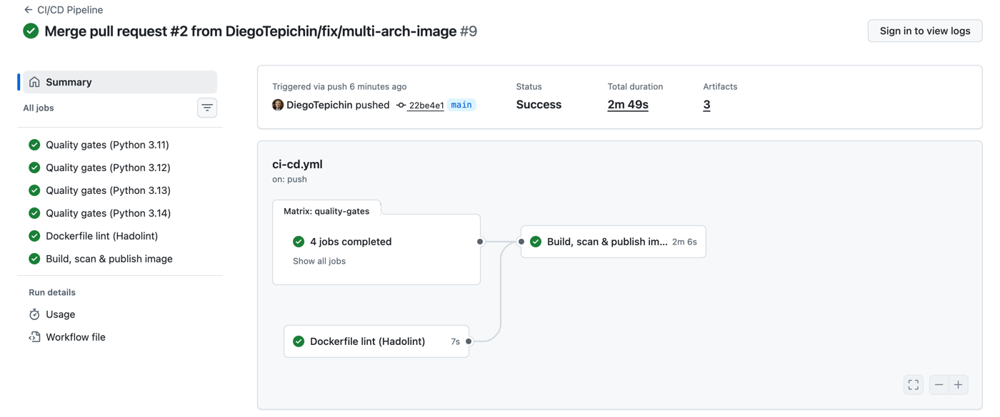
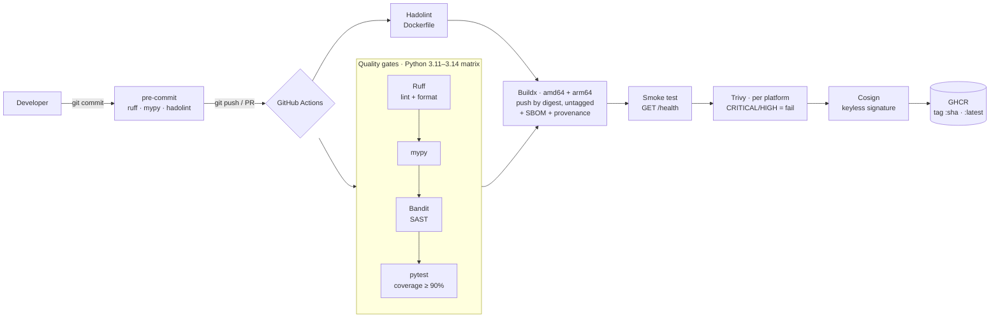
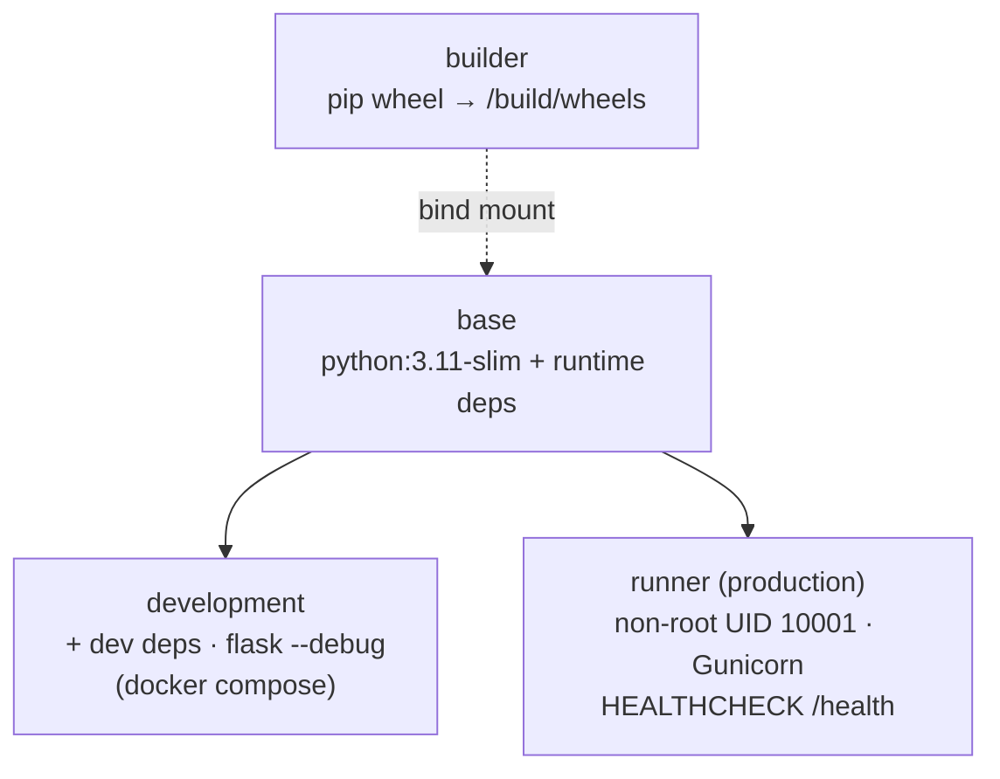

**English** | [Español](README.es.md)

# CI/CD Pipeline — Production-ready Flask API

A Flask REST API shipped through a security-gated CI/CD pipeline: lint, type checking, SAST, tests, a hardened Docker image, a smoke test, a vulnerability scan, and a signed, SBOM-attested image published to GHCR.

[](https://github.com/DiegoTepichin/cicd-pipeline/actions/workflows/ci-cd.yml?query=branch%3Amain)


[](LICENSE)

The API is deliberately small. It serves as the **vehicle for a complete software delivery chain**. Every change goes through linting, static typing, security analysis, tests with a coverage threshold, a hardened image build, a smoke test and a vulnerability scan. Only then is the image signed and published to a container registry.



*A green run on `main`: the Python 3.11–3.14 quality-gate matrix and Hadolint feed the build, smoke test, Trivy scan and GHCR publish job.*

---

## Why

On many teams, the path from "works on my machine" to "running in production" is manual, inconsistent and has no security controls. This repository is a reproducible template that ensures:

- **No change reaches `main` without passing automated quality gates.** The gates are the same locally (`make check`, pre-commit) and in CI.
- **Vulnerabilities are caught before deployment**, both in the code (Bandit, SAST) and in the image (Trivy: OS and library CVEs).
- **The deployable artifact is immutable and traceable**: every image is tagged with the SHA of the commit that produced it.
- **What was scanned is exactly what gets published**: the image is pushed once by digest, gated, signed with Cosign and only then tagged. It ships with an SBOM and build provenance, so anyone can verify where it came from and what it contains.
- **The local environment matches production**: the development and production images are built from the same base stage of a multi-stage Dockerfile, and the dev target has hot-reload.

---

## Architecture

### Pipeline flow



The diagram shows a push to `main`. Pull requests run the same gates on a local, single-arch build and never push.

### Multi-stage Docker image



### Repository layout

```
.
├── app/
│   ├── main.py              # create_app() factory, routes and error handlers
│   └── requirements.txt     # Runtime dependencies (consumed by Docker)
├── tests/
│   └── test_main.py         # Endpoint and error-path tests
├── .github/workflows/
│   └── ci-cd.yml            # Pipeline: quality gates → build → smoke → scan → sign → tag
├── .github/dependabot.yml   # Weekly updates for pinned actions and Python deps
├── Dockerfile               # builder / base / development / runner
├── docker-compose.yml       # Local stack with hot-reload
├── pyproject.toml           # Metadata, dependencies and ruff/mypy/pytest/bandit config
├── .pre-commit-config.yaml  # Same gates as CI, before every commit
├── Makefile                 # Single command interface (make help)
└── .env.example             # Documented environment variables
```

### API

| Method | Path        | Description                                      | Response                                                 |
|--------|-------------|--------------------------------------------------|----------------------------------------------------------|
| GET    | `/`         | Service metadata                                 | `200 {"status":"success","message":…,"version":…}`       |
| GET    | `/health`   | Liveness probe (Docker, load balancers, K8s)     | `200 {"status":"healthy"}`                               |
| *      | other paths | HTTP error serialized as JSON                    | `404/405 {"status":"error","error":…,"message":…}`       |
| *      | exception   | Generic internal error, no details leaked        | `500 {"status":"error","error":"Internal Server Error"}` |

---

## Tech stack and key decisions

| Area | Choice | Why |
|------|--------|-----|
| Framework | **Flask 3** + application factory | Minimal and explicit. `create_app()` gives each test an isolated instance with injectable config. |
| WSGI server | **Gunicorn** | Flask's dev server isn't meant for production. Workers and threads are tuned through `GUNICORN_CMD_ARGS` without rebuilding the image. |
| Packaging | **pyproject.toml** (PEP 621) | A single source of truth for dependencies and tooling. `requirements.txt` holds only runtime deps to keep the image lean. |
| Lint / format | **Ruff** | One very fast tool that replaces flake8, isort, black and pyupgrade. Includes the `S` (bandit) and `B` (bugbear) rules. |
| Typing | **mypy** (`disallow_untyped_defs`) | Requires typed signatures, so contract errors surface before the code runs. |
| SAST | **Bandit** | Flags insecure Python patterns. It has already caught a real issue in this repo: a hardcoded `0.0.0.0` bind. |
| Container | **Multi-stage Docker** | Wheels are bind-mounted from the builder and never become a layer. Runs as a non-root user with a fixed numeric UID (compatible with Kubernetes `runAsNonRoot`) and ships a `HEALTHCHECK`. Build-only tooling (setuptools, wheel) is removed from the runtime image. |
| Image scanning | **Trivy** | Fails the pipeline on `CRITICAL`/`HIGH` CVEs that already have a fix. On `main` it scans the pushed digest for both architectures. |
| Supply chain | **Cosign** (keyless) + **BuildKit** SBOM/provenance | The image is signed with the workflow's OIDC identity through Sigstore, so there are no keys to store or rotate. Each platform carries an SPDX SBOM and SLSA provenance, and the signature covers them. |
| Registry | **GitHub Container Registry** | Authenticates with the built-in `GITHUB_TOKEN`, so there are no long-lived secrets to manage. Images are multi-arch (`linux/amd64` and `linux/arm64`), so they run natively on x86 servers and on Apple Silicon or Graviton. |
| CI/CD | **GitHub Actions** | Python matrix, pip and Buildx layer caching (GHA), `concurrency` to cancel superseded runs, and a read-only token by default (`packages: write` and `id-token: write` only for the publish job). Every action is pinned to a commit SHA and kept current by **Dependabot**. |
| Shift-left | **pre-commit** | Ruff, mypy and Hadolint run before every commit, so failures show up locally instead of in CI. |

---

## Getting started

### Requirements

- Python 3.11+
- Docker 24+ with BuildKit (included in Docker Desktop)
- `make`

### Quickstart

```bash
git clone https://github.com/DiegoTepichin/cicd-pipeline.git && cd cicd-pipeline
python3 -m venv .venv && source .venv/bin/activate
make install                  # pip install -e ".[dev]" + pre-commit install
make check                    # lint + typecheck + security + test (same gates as CI)
make dev                      # http://localhost:5000 with auto-reload
```

> **macOS note:** AirPlay Receiver listens on port 5000, so `localhost:5000` answers with `403 AirTunes`. Pass another host port to any target, e.g. `make dev PORT=5001`, `make run PORT=5001` or `make up PORT=5001`, or turn off AirPlay Receiver in System Settings.

### Configuration

| Variable            | Default                                                   | Purpose |
|---------------------|-----------------------------------------------------------|---------|
| `APP_NAME`          | `CI/CD Pipeline`                                          | Name returned by `/` |
| `APP_VERSION`       | `1.0.0`                                                   | Version returned by `/` |
| `LOG_LEVEL`         | `INFO`                                                    | Logging level (`DEBUG`, `INFO`, `WARNING`…) |
| `HOST` / `PORT`     | `127.0.0.1` / `5000`                                      | Only for `python -m app.main` |
| `GUNICORN_CMD_ARGS` | `--workers 2 --threads 4 --timeout 30 --access-logfile -` | Gunicorn tuning in the production image |

Set these as regular environment variables, or with `docker run -e`. A `.env` file (`cp .env.example .env`) is **only read by Docker Compose** (`make up`). `make dev` and `python -m app.main` do not load it.

### Running tests

```bash
make test                     # pytest with coverage report
make check                    # every CI gate: ruff, mypy, bandit, pytest
make help                     # list all targets
```

The suite has **97% coverage, CI-enforced ≥90%** (`fail_under` in `pyproject.toml`).

### Docker

**Development stack (hot-reload):**

```bash
make up                       # docker compose up --build → http://localhost:5000
make down
```

**Production image:**

```bash
make build                    # docker build --target runner
make run                      # http://localhost:5000
curl localhost:5000/health    # {"status":"healthy"}
```

### Continuous delivery (GHCR)

On every push to `main`, the `publish` job builds the multi-arch image once and pushes it **by digest, without a tag**. It then runs the smoke test and a Trivy scan per architecture against that exact digest, signs it with Cosign, and only then points the `:<commit-sha>` and `:latest` tags at it. If a gate fails, no tag moves:

```bash
docker pull ghcr.io/diegotepichin/cicd-pipeline:latest
docker pull ghcr.io/diegotepichin/cicd-pipeline:<commit-sha>
```

Images are built for `linux/amd64` and `linux/arm64`, and Docker pulls the right one automatically. The job authenticates with the workflow's `GITHUB_TOKEN`, so no extra secrets are needed. Pull requests run the build, smoke test and scan in the `image-check` job, but they don't push anything.

**Verify an image** (requires [Cosign](https://docs.sigstore.dev/cosign/system_config/installation/)). The signature must come from this repository's workflow on `main`. The last two commands print the SBOM and the build provenance:

```bash
cosign verify ghcr.io/diegotepichin/cicd-pipeline:latest \
  --certificate-identity https://github.com/DiegoTepichin/cicd-pipeline/.github/workflows/ci-cd.yml@refs/heads/main \
  --certificate-oidc-issuer https://token.actions.githubusercontent.com

docker buildx imagetools inspect ghcr.io/diegotepichin/cicd-pipeline:latest --format '{{ json .SBOM }}'
docker buildx imagetools inspect ghcr.io/diegotepichin/cicd-pipeline:latest --format '{{ json .Provenance }}'
```

### Production integration

The `runner` image is stateless and fully configured through environment variables. It is **designed to be compatible with Kubernetes, AWS ECS and Cloud Run**, although it hasn't been deployed to any of them as part of this project:

- **Kubernetes:** `/health` can serve as `livenessProbe` and `readinessProbe`. The numeric UID 10001 satisfies `runAsNonRoot: true`.
- **ECS / Cloud Run:** expose port `5000` and tune concurrency with `GUNICORN_CMD_ARGS`.
- **Rollbacks:** deploy by SHA tag, not `:latest`. Every image is immutable and traceable to its commit.

---

## Metrics and practices

Measured locally on this commit:

| Metric | Value |
|--------|-------|
| Test coverage | **97%** (CI-enforced minimum: 90%) |
| Test suite | 5 tests in < 1 s |
| Production image (`runner`) | **234 MB** (vs. 353 MB for the `development` target) |
| Bandit / Hadolint / mypy findings | **0** |
| Fixable CRITICAL/HIGH CVEs (Trivy) | **0** |
| Runtime user | `uid=10001` (non-root) |

**Scalability.** The API is stateless, so it scales horizontally behind a load balancer with no changes. Vertically, Gunicorn uses workers (processes) × threads, configurable at runtime. A common starting point is `workers = 2 × CPU + 1`.

**Practices applied:** 12-Factor App (config through the environment, logs to stdout), least privilege (non-root container, read-only CI token by default), shift-left security (SAST, image scanning, pre-commit), supply-chain security (signed images, SBOM, provenance, SHA-pinned actions), immutable artifacts, errors that never leak internal details, and Conventional Commits.

---

## Roadmap

- [x] Pin every GitHub Action by commit SHA, with Dependabot updates
- [x] Generate an SBOM and sign the image (BuildKit's Syft scanner + Cosign)
- [ ] Structured JSON logging and a `/metrics` endpoint (Prometheus)
- [ ] Separate liveness and readiness once there are external dependencies
- [ ] Automatic deployment to a staging environment

---

## Contributing

See [CONTRIBUTING.md](CONTRIBUTING.md) for setup, the `make check` workflow and commit conventions.

## License

[MIT](LICENSE) © 2026 Diego Tepichin

## Author

**Diego Tepichin**, Systems Engineer · Founder of CAFE · [GitHub @DiegoTepichin](https://github.com/DiegoTepichin)
